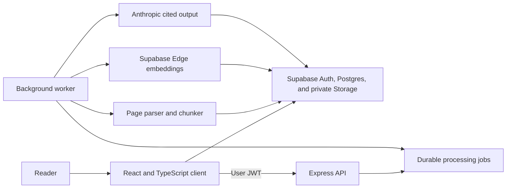

# Briefly

Briefly turns dense text and private documents into structured, source-grounded reading briefs. Users can upload files, return to saved work, verify claims against source pages, and ask questions whose answers include checked citations.

Live preview: https://ai-summarizer-app-zeta.vercel.app

## Product workflow

1. Add a report, article, meeting transcript, or technical note.
2. Choose an executive brief, key points, study notes, or action items.
3. Set the detail level and reader expertise.
4. Generate, review, copy, download, or revisit the brief.
5. Compare an earlier and later document to review cited additions, removals, and changed claims.

The public text preview does not require an account. It supports source text up to 20,000 characters and stores recent results only in browser memory. The authenticated workspace accepts private PDF, DOCX, Markdown, and text files up to 15 MB.

## Architecture



The frontend runs on Vercel. The Express API runs on Render. Docker Compose runs the same split locally.

## Engineering decisions

- The API accepts explicit mode, length, and audience values instead of arbitrary prompt text.
- The prompt treats source material as untrusted content and instructs the model not to follow embedded instructions.
- The server checks cited pages and quotations against the source before it saves AI output.
- Version comparisons keep earlier and later sources separate and require changed findings to cite both documents.
- Row-level security scopes documents, pages, briefs, conversations, messages, and jobs to their owners.
- Private Storage uses user-scoped paths and one-hour signed preview URLs.
- A polling worker moves parsing, embedding, and document summaries outside API request lifecycles. It can run as a dedicated process or inside the API container for free-tier deployments.
- The API validates request size and options before it calls the model provider.
- The server returns safe client errors and logs internal provider details with a request ID.
- The frontend uses a 65-second timeout and preserves user input after errors.
- CI runs backend integration tests, frontend component tests, TypeScript checks, and a production build.
- Dependabot checks application packages and GitHub Actions every month.

## Stack

| Layer | Technology |
| --- | --- |
| Client | React 19, TypeScript, Vite |
| API | Node.js 24, Express 5 |
| AI provider | Anthropic Messages API |
| Auth, database, storage | Supabase Auth, Postgres, pgvector, Storage |
| Embeddings | Supabase Edge Runtime `gte-small` |
| Tests | Node test runner, Vitest, Testing Library |
| Delivery | Docker, GitHub Actions, Vercel, Render |

## Local setup

### Requirements

- Node.js 24 LTS
- An Anthropic API key
- A Supabase project or the Supabase CLI and Docker Desktop

### Run without Docker

```bash
git clone https://github.com/prathima-sola/ai-summarizer-app.git
cd ai-summarizer-app
cp backend/.env.example backend/.env
```

Add `ANTHROPIC_API_KEY` to `backend/.env`.

Create the frontend environment file.

```bash
cp frontend/.env.example frontend/.env.local
```

Add the Supabase project URL and publishable key to `frontend/.env.local`. Add the project URL, publishable key, and service-role key to `backend/.env`.

Apply the database migration and deploy both embedding functions.

```bash
npx supabase login
npx supabase link --project-ref your-project-ref
npx supabase db push
npx supabase functions deploy embed-document
npx supabase functions deploy search-document
```

```bash
cd backend
npm ci
npm start
```

Open a second terminal for document jobs.

```bash
cd backend
npm run worker
```

Open a third terminal.

```bash
cd frontend
npm ci
npm run dev
```

Open `http://localhost:3000`.

### Run with Docker

```bash
docker compose --profile documents up --build
```

## Environment variables

| Variable | Required | Purpose |
| --- | --- | --- |
| `ANTHROPIC_API_KEY` | Yes | Authenticates model requests |
| `ANTHROPIC_MODEL` | No | Overrides the configured model |
| `ALLOWED_ORIGINS` | No | Defines comma-separated browser origins |
| `RATE_LIMIT_MAX` | No | Sets requests per 15-minute window |
| `PORT` | No | Sets the API port, which defaults to 3001 |
| `VITE_API_URL` | No | Overrides the frontend API base URL at build time |
| `VITE_SUPABASE_URL` | Workspace | Connects the browser to Supabase |
| `VITE_SUPABASE_PUBLISHABLE_KEY` | Workspace | Authenticates public browser requests that RLS checks |
| `SUPABASE_URL` | Workspace | Connects the API and worker to Supabase |
| `SUPABASE_PUBLISHABLE_KEY` | Workspace | Lets the API validate user sessions |
| `SUPABASE_SERVICE_ROLE_KEY` | Workspace | Lets the trusted worker process owned documents |
| `RUN_DOCUMENT_WORKER` | No | Runs the queue processor inside the API container when set to `true` |
| `WORKER_POLL_INTERVAL_MS` | No | Controls how often an idle worker checks the queue |

## API

### `POST /api/summaries`

```json
{
  "text": "Source text",
  "mode": "executive",
  "length": "balanced",
  "audience": "general"
}
```

Supported modes include `executive`, `key-points`, `study-notes`, and `action-items`.

### `GET /health`

The health endpoint returns the API status without calling the AI provider.

### Authenticated document routes

- `POST /api/documents/:documentId/ingest` queues parsing and indexing.
- `POST /api/documents/:documentId/summaries` queues a structured cited brief.
- `POST /api/documents/:documentId/questions` returns and saves a source-grounded answer.
- `POST /api/comparisons` creates and saves a cited comparison between two owned documents.

Each document route requires `Authorization: Bearer <user-jwt>` and verifies document ownership.

## Verification

```bash
cd backend && npm test
cd ../frontend && npm test && npm run build
```

## Delivery roadmap

- Phase 1 establishes a reliable text workflow, typed frontend, hardened API, tests, CI, and a production interface.
- Phase 2 delivers file ingestion, background jobs, authentication, durable workspaces, verified page citations, and document Q&A.
- Phase 3 adds document comparison, OCR, quality evaluations, cost telemetry, shareable briefs, and deeper observability. Cited document comparison is complete.

See [docs/roadmap.md](docs/roadmap.md) for acceptance criteria and implementation order.
