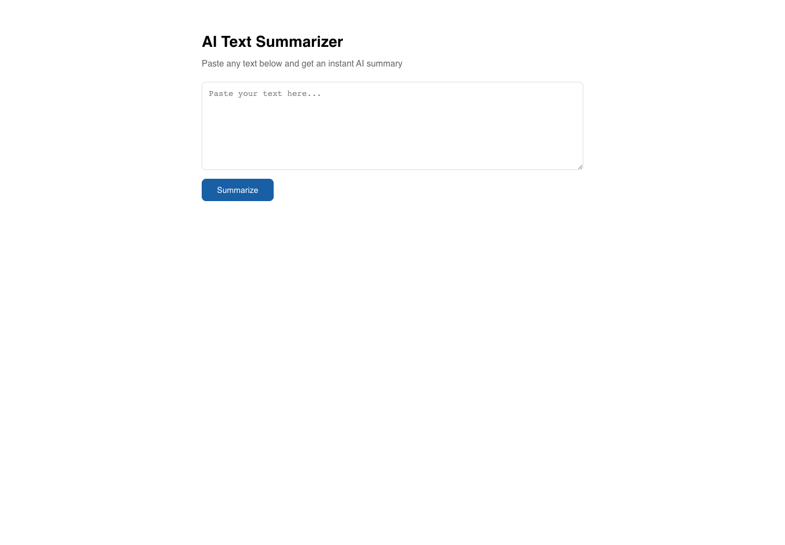
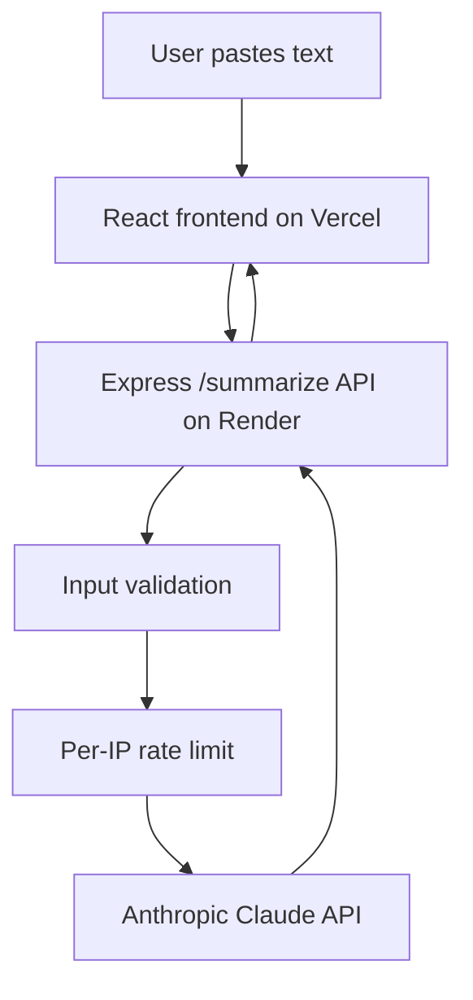

# AI Text Summarizer

A full-stack summarization app with a React frontend, Node.js/Express backend, Claude API call, Docker setup, and GitHub Actions checks.

Live app: https://ai-summarizer-app-zeta.vercel.app



## Architecture



## Proof points

| Area | Evidence |
| --- | --- |
| Full-stack split | React frontend and Express backend run as separate services |
| API protection | Empty input rejection, 5,000-character cap, per-IP rate limits |
| Deployment | Frontend on Vercel, backend on Render |
| Container setup | Dockerfiles plus `docker-compose.yml` |
| CI | GitHub Actions installs dependencies and checks backend/frontend startup/build paths |

## Tech stack

- React
- Node.js, Express
- Anthropic Claude API
- Docker, Docker Compose
- GitHub Actions
- Vercel, Render

## Setup

```bash
git clone https://github.com/prathima-sola/ai-summarizer-app
cd ai-summarizer-app
cp backend/.env.example backend/.env
docker-compose up --build
```

Frontend: `http://localhost:3000`
Backend: `http://localhost:3001`

## Environment

```bash
ANTHROPIC_API_KEY=
```

Store the key in `backend/.env`. Do not expose it in the frontend.

## Test commands

```bash
cd frontend
npm install
npm run build

cd ../backend
npm install
node -e "require('./server.js')"
```

The backend currently has a startup check rather than a full unit test suite.

## Deployment notes

- Vercel hosts the React frontend.
- Render hosts the Express backend.
- The backend reads `ANTHROPIC_API_KEY` from environment variables.
- `docker-compose.yml` runs both services locally for a closer production match than plain `npm start`.

## API behavior

`POST /summarize`

```json
{
  "text": "Text to summarize"
}
```

Validation:

- Rejects empty text.
- Rejects text longer than 5,000 characters.
- Limits repeated requests from the same IP.
