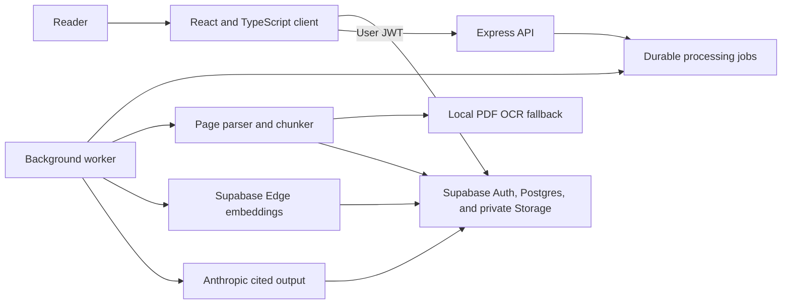

# Briefly

Briefly processes private documents into cited summaries and grounded answers. It supports PDF, DOCX, Markdown, and text files.

[Live app](https://ai-summarizer-app-zeta.vercel.app/)


## Features

- Source-grounded summaries with verified page citations
- Document Q&A and cited version comparisons
- Private user workspaces backed by row-level security
- OCR fallback for image-only PDF pages
- Expiring, revocable read-only share links
- Background processing with saved job state

The public text preview accepts up to 20,000 characters without an account. The authenticated workspace accepts files up to 15 MB.

## Architecture



The frontend runs on Vercel. The Express API runs on Render. Supabase provides authentication, Postgres, pgvector, and private file storage. Docker Compose runs the same split locally.

## Stack

| Layer | Technology |
| --- | --- |
| Client | React 19, TypeScript, Vite |
| API | Node.js 24, Express 5 |
| AI provider | Anthropic Messages API |
| Auth, database, storage | Supabase Auth, Postgres, pgvector, Storage |
| Embeddings | Supabase Edge Runtime `gte-small` |
| Tests | Node test runner, Vitest, Testing Library, Playwright |
| Delivery | Docker, GitHub Actions, Vercel, Render |

## Local setup

### Requirements

- Node.js 24 LTS
- An Anthropic API key
- A Supabase project or the Supabase CLI and Docker Desktop

### Run without Docker

```bash
git clone https://github.com/prathima-sola/ai-summarizer-app.git
cd ai-summarizer-app
cp backend/.env.example backend/.env
```

Add `ANTHROPIC_API_KEY` to `backend/.env`.

Create the frontend environment file.

```bash
cp frontend/.env.example frontend/.env.local
```

Add the Supabase project URL and publishable key to `frontend/.env.local`. Add the project URL, publishable key, and service-role key to `backend/.env`.

Apply the database migration and deploy both embedding functions.

```bash
npx supabase login
npx supabase link --project-ref your-project-ref
npx supabase db push
npx supabase functions deploy embed-document
npx supabase functions deploy search-document
```

```bash
cd backend
npm ci
npm start
```

Open a second terminal for document jobs.

```bash
cd backend
npm run worker
```

Open a third terminal.

```bash
cd frontend
npm ci
npm run dev
```

Open `http://localhost:3000`.

### Run with Docker

```bash
docker compose --profile documents up --build
```

## Environment variables

Copy the provided example files and add these required values:

- `ANTHROPIC_API_KEY` in `backend/.env`
- Supabase URL and publishable key in both environment files
- Supabase service-role key in `backend/.env` only

The example files document optional settings such as allowed origins, rate limits, worker polling, and OCR limits. Never expose the service-role key through a `VITE_` variable.

## API

### `POST /api/summaries`

```json
{
  "text": "Source text",
  "mode": "executive",
  "length": "balanced",
  "audience": "general"
}
```

Supported modes include `executive`, `key-points`, `study-notes`, and `action-items`.

### `GET /health`

The health endpoint returns process status, release metadata, and uptime without calling a dependency.

### `GET /ready`

The readiness endpoint checks database access and reports the configured worker mode. Deploy probes use it to distinguish a running process from a usable service.

### Authenticated document routes

- `POST /api/documents/:documentId/ingest` queues parsing and indexing.
- `POST /api/documents/:documentId/summaries` queues a structured cited brief.
- `POST /api/documents/:documentId/questions` returns and saves a source-grounded answer.
- `POST /api/comparisons` creates and saves a cited comparison between two owned documents.
- `GET /api/shares` lists active link metadata for one owned brief or comparison.
- `POST /api/shares` replaces and returns a 30-day read-only link for one owned brief or comparison.
- `DELETE /api/shares/:shareId` revokes an owned link immediately.
- `GET /api/quality` returns quality and operational telemetry for the authenticated workspace.
- `POST /api/evaluations/run` evaluates up to 100 recent briefs and comparisons with the committed deterministic grounding baseline.

`GET /api/public/shares/:token` returns the limited public payload for an active capability link. It does not return source files, extracted pages, account data, or model telemetry.

Each document route requires `Authorization: Bearer <user-jwt>` and verifies document ownership.

## Tests

```bash
cd backend && npm test
cd backend && npm run eval
cd ../frontend && npm test && npm run build
```

Run the end-to-end suite separately because it uses the configured Supabase project and AI provider:

```bash
cd frontend
cp .env.e2e.example .env.e2e.local
npx playwright install chromium
npm run test:e2e
```

Use `frontend/.env.e2e.example` as the template. The suite deletes its temporary user and test data during teardown.
