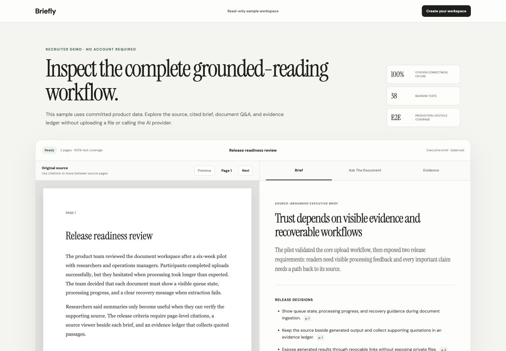
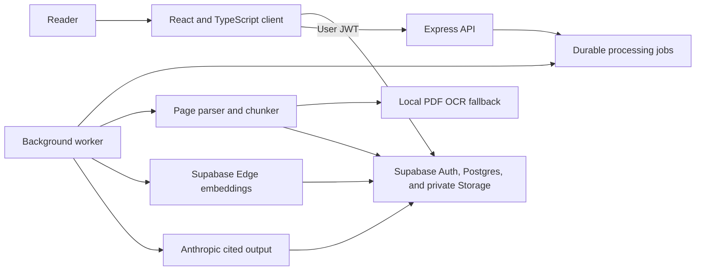

# Briefly

Briefly processes private documents into cited summaries and grounded answers. It supports PDF, DOCX, Markdown, and text files.

[Live app](https://ai-summarizer-app-zeta.vercel.app/) · [Sample workspace](https://ai-summarizer-app-zeta.vercel.app/demo)



## Features

- Source-grounded summaries with verified page citations
- Document Q&A and cited version comparisons
- Private user workspaces backed by row-level security
- OCR fallback for image-only PDF pages
- Expiring, revocable read-only share links
- Background processing with saved job state

The public text preview accepts up to 20,000 characters without an account. The authenticated workspace accepts files up to 15 MB.

## Architecture



The frontend runs on Vercel. The Express API runs on Render. Supabase provides authentication, Postgres, pgvector, and private file storage. Docker Compose runs the same split locally.

## Implementation notes

- The API accepts explicit mode, length, and audience values instead of arbitrary prompt text.
- The prompt treats source material as untrusted content and instructs the model not to follow embedded instructions.
- The server checks cited pages and quotations against the source before it saves AI output.
- Version comparisons keep earlier and later sources separate and require changed findings to cite both documents.
- Row-level security scopes documents, pages, briefs, conversations, messages, and jobs to their owners.
- Private Storage uses user-scoped paths and one-hour signed preview URLs.
- A polling worker moves parsing, embedding, and document summaries outside API request lifecycles. It can run as a dedicated process or inside the API container for free-tier deployments.
- The parser runs OCR only on sparse PDF pages, preserves their original page numbers, and reports OCR coverage and mean confidence.
- The API validates request size and options before it calls the model provider.
- The server returns safe client errors and logs internal provider details with a request ID.
- CI runs backend tests, frontend tests, deterministic evaluation fixtures, TypeScript checks, a production build, and dependency audits.
- Scheduled checks probe frontend availability and API dependency readiness.

## Stack

| Layer | Technology |
| --- | --- |
| Client | React 19, TypeScript, Vite |
| API | Node.js 24, Express 5 |
| AI provider | Anthropic Messages API |
| Auth, database, storage | Supabase Auth, Postgres, pgvector, Storage |
| Embeddings | Supabase Edge Runtime `gte-small` |
| Tests | Node test runner, Vitest, Testing Library, Playwright |
| Delivery | Docker, GitHub Actions, Vercel, Render |

## Local setup

### Requirements

- Node.js 24 LTS
- An Anthropic API key
- A Supabase project or the Supabase CLI and Docker Desktop

### Run without Docker

```bash
git clone https://github.com/prathima-sola/ai-summarizer-app.git
cd ai-summarizer-app
cp backend/.env.example backend/.env
```

Add `ANTHROPIC_API_KEY` to `backend/.env`.

Create the frontend environment file.

```bash
cp frontend/.env.example frontend/.env.local
```

Add the Supabase project URL and publishable key to `frontend/.env.local`. Add the project URL, publishable key, and service-role key to `backend/.env`.

Apply the database migration and deploy both embedding functions.

```bash
npx supabase login
npx supabase link --project-ref your-project-ref
npx supabase db push
npx supabase functions deploy embed-document
npx supabase functions deploy search-document
```

```bash
cd backend
npm ci
npm start
```

Open a second terminal for document jobs.

```bash
cd backend
npm run worker
```

Open a third terminal.

```bash
cd frontend
npm ci
npm run dev
```

Open `http://localhost:3000`.

### Run with Docker

```bash
docker compose --profile documents up --build
```

## Environment variables

| Variable | Required | Purpose |
| --- | --- | --- |
| `ANTHROPIC_API_KEY` | Yes | Authenticates model requests |
| `ANTHROPIC_MODEL` | No | Overrides the configured model |
| `ALLOWED_ORIGINS` | No | Defines comma-separated browser origins |
| `RATE_LIMIT_MAX` | No | Sets requests per 15-minute window |
| `PORT` | No | Sets the API port, which defaults to 3001 |
| `VITE_API_URL` | No | Overrides the frontend API base URL at build time |
| `VITE_SUPABASE_URL` | Workspace | Connects the browser to Supabase |
| `VITE_SUPABASE_PUBLISHABLE_KEY` | Workspace | Authenticates public browser requests that RLS checks |
| `SUPABASE_URL` | Workspace | Connects the API and worker to Supabase |
| `SUPABASE_PUBLISHABLE_KEY` | Workspace | Lets the API validate user sessions |
| `SUPABASE_SERVICE_ROLE_KEY` | Workspace | Lets the trusted worker process owned documents |
| `RUN_DOCUMENT_WORKER` | No | Runs the queue processor inside the API container when set to `true` |
| `WORKER_POLL_INTERVAL_MS` | No | Controls how often an idle worker checks the queue |
| `OCR_MAX_PAGES` | No | Caps OCR work per PDF, which defaults to 25 scanned pages |
| `OCR_RENDER_SCALE` | No | Controls scanned-page rendering resolution, which defaults to 2 |

### Scanned PDF support

Briefly first extracts embedded PDF text because native extraction is faster and more accurate. It renders and OCRs only pages with fewer than 20 readable characters. The document workspace reports whether OCR completed, recovered only part of the PDF, or could not recover readable text.

The bundled model supports printed English text. Handwriting, damaged scans, unusual fonts, and non-English documents can produce incomplete results. OCR processes at most 25 pages by default to protect the free Render worker from unbounded CPU and memory use. Set `OCR_MAX_PAGES` for a larger worker when needed.

## API

### `POST /api/summaries`

```json
{
  "text": "Source text",
  "mode": "executive",
  "length": "balanced",
  "audience": "general"
}
```

Supported modes include `executive`, `key-points`, `study-notes`, and `action-items`.

### `GET /health`

The health endpoint returns process status, release metadata, and uptime without calling a dependency.

### `GET /ready`

The readiness endpoint checks database access and reports the configured worker mode. Deploy probes use it to distinguish a running process from a usable service.

### Authenticated document routes

- `POST /api/documents/:documentId/ingest` queues parsing and indexing.
- `POST /api/documents/:documentId/summaries` queues a structured cited brief.
- `POST /api/documents/:documentId/questions` returns and saves a source-grounded answer.
- `POST /api/comparisons` creates and saves a cited comparison between two owned documents.
- `GET /api/shares` lists active link metadata for one owned brief or comparison.
- `POST /api/shares` replaces and returns a 30-day read-only link for one owned brief or comparison.
- `DELETE /api/shares/:shareId` revokes an owned link immediately.
- `GET /api/quality` returns quality and operational telemetry for the authenticated workspace.
- `POST /api/evaluations/run` evaluates up to 100 recent briefs and comparisons with the committed deterministic grounding baseline.

`GET /api/public/shares/:token` returns the limited public payload for an active capability link. It does not return source files, extracted pages, account data, or model telemetry.

Each document route requires `Authorization: Bearer <user-jwt>` and verifies document ownership.

## Verification

```bash
cd backend && npm test
cd backend && npm run eval
cd ../frontend && npm test && npm run build
```

### Production lifecycle test

The Playwright suite checks the private-workspace boundary and runs the complete document lifecycle against a deployed environment: upload, processing, cited brief generation, export, public sharing, revocation, and deletion. It creates a temporary confirmed Supabase user for each run and removes that user's files and records during teardown.

Keep this test separate from the fast pull-request checks because it calls the live worker and AI provider.

```bash
cd frontend
cp .env.e2e.example .env.e2e.local
npx playwright install chromium
npm run test:e2e
```

Set `E2E_BASE_URL` to the deployed frontend. Add the same Supabase project URL, publishable key, and service-role key used by that deployment. Never commit `.env.e2e.local` or expose the service-role key to browser code.

CI can install Chromium and run the suite with repository secrets:

```bash
npx playwright install --with-deps chromium
npm run test:e2e:ci
```

Provide `E2E_BASE_URL`, `SUPABASE_URL`, `SUPABASE_PUBLISHABLE_KEY`, and `SUPABASE_SERVICE_ROLE_KEY` as protected CI environment variables. Run this command only from the production-smoke workflow.
