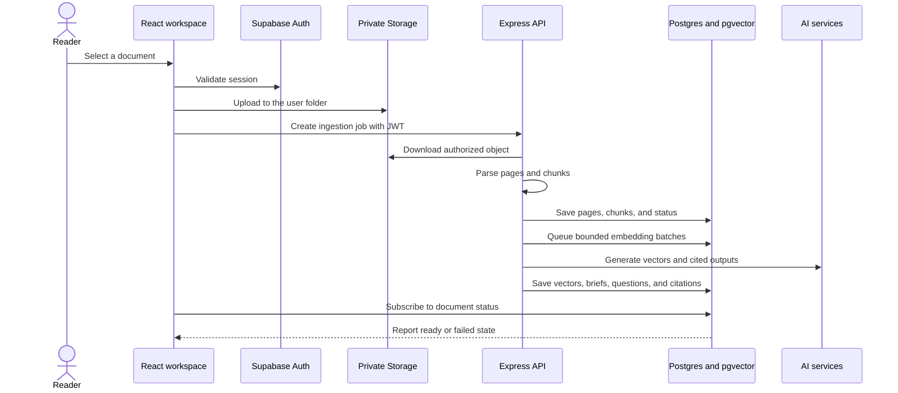

# Phase 2 architecture

## Security boundary

Supabase Auth issues user sessions. The browser uses the publishable key and user JWT. The API verifies that JWT before it performs document processing. The service-role key stays inside the backend and never enters a frontend bundle.

Row-level security protects every user-owned table. Storage policies restrict private files to paths whose first folder matches the authenticated user ID.

## Data flow

## Tables

- `profiles` stores user-facing profile data.
- `documents` stores ownership, file metadata, processing state, and storage paths.
- `document_pages` preserves page boundaries for citations.
- `document_chunks` stores retrieval units, full-text indexes, and 384-dimensional vectors.
- `summaries` stores output, citations, prompt versions, model metadata, latency, and token usage.
- `conversations` and `messages` persist document Q&A.
- `processing_jobs` records ingestion progress, attempts, and failures.

## Retrieval

The schema supports semantic search with `gte-small` embeddings and an HNSW index. It also supports Postgres full-text search when an embedding job has not finished. Both database functions enforce document ownership before returning source chunks.

## File constraints

The private `documents` bucket accepts PDF, DOCX, Markdown, and plain-text files up to 15 MiB. The application rejects unsupported files before upload and repeats validation in the ingestion API.

PDF extraction records the percentage of pages that contain readable text. The workspace flags low-coverage files instead of hiding missing content. Fully scanned PDFs currently require OCR before upload.

## Citation integrity

The model returns structured claims, page numbers, and quotations through forced tool output. The API checks every page against the retrieved chunks and confirms that every quotation appears in the claimed source page. It rejects the entire output when a citation fails verification.

## Worker deployment

The API and document worker use the same backend image. The API handles authenticated requests. The worker claims jobs with a service-role-only Postgres function and processes parsing, bounded embedding batches, and cited brief generation outside the request lifecycle. Production platforms can run the worker as a dedicated process. Free-tier deployments can set `RUN_DOCUMENT_WORKER=true` to run the same queue processor inside the API container.
