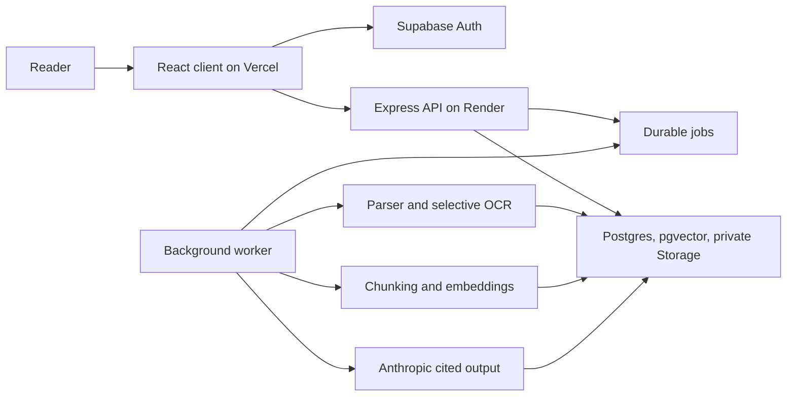

# Briefly engineering case study

## Product problem

People can generate a summary quickly, but they still need to decide whether to trust it. Briefly makes verification part of the reading workflow. A reader can inspect the original page beside a brief, ask a grounded question, collect supporting quotations, compare versions, and share the result without exposing the private file.

## Jobs to be done

| Current friction | Core trigger | Desired outcome |
| --- | --- | --- |
| A long report takes too much time to scan, and a plain summary hides its evidence. | A reader must brief a team, prepare for a meeting, or review a changed document. | Upload once, get a structured brief, and verify each important claim in the same screen. |
| Scanned files fail in text-only tools. | A user receives an image-only PDF from a scanner or legacy archive. | Recover readable text while preserving page numbers for citations. |
| Public AI tools create privacy and sharing concerns. | A reader needs to collaborate without distributing the original file. | Keep the source private and share a result through a link the owner can revoke. |

The first useful moment occurs when a user opens a cited claim and sees the matching source page. That interaction proves the brief supports verification instead of asking for blind trust.

## Fears and objections checklist

The interface and architecture address recurring complaints from document AI users:

- [x] “Will a large document stall or fail?” The workspace shows queued, processing, recovery, and failure states. Background jobs keep long parsing work outside request lifecycles.
- [x] “Can I trust the answer?” The server checks cited page numbers and quotations before saving generated output.
- [x] “What happens to scanned pages and tables?” Sparse-page OCR recovers printed English text and reports coverage. The UI states OCR limits instead of hiding them.
- [x] “Will the answer drift away from my file?” Document Q&A retrieves owned source chunks and requires citations.
- [x] “Can another user see my document?” Row-level rules, owner-scoped file paths, signed previews, and server-side ownership checks protect each workspace.
- [x] “Can a shared link expose the original file?” Public payloads include only generated results and supporting quotations. Owners can revoke each link.
- [x] “Will the app work before I create an account?” The committed `/demo` route shows the complete reading workflow without an upload, AI call, or seeded production account.

These concerns appear in reviews for document summarization products. Users praise fast answers and references, then criticize slow preprocessing, upload failures, vague answers, and privacy uncertainty. See [Pensieve feedback on Product Hunt](https://www.producthunt.com/products/pensieve-2/reviews), [ChatPDF feedback on Product Hunt](https://www.producthunt.com/products/chatpdf/reviews), [PDF.ai feedback on Product Hunt](https://www.producthunt.com/products/pdf-ai/reviews), and [AI summarizer feedback on G2](https://www.g2.com/categories/ai-summarizers).

## Architecture decisions

- The API accepts enumerated product settings instead of arbitrary prompts. This keeps behavior testable and reduces prompt injection surface.
- The worker owns parsing, OCR, embeddings, and long model calls. The API can respond before expensive work completes.
- The database stores pages separately so citations preserve the document’s page model.
- Retrieval and generation stay behind authenticated server routes. The browser never receives service-role credentials.
- The system validates citations after generation. Prompt instructions alone cannot guarantee grounded output.
- Public sharing uses a narrow capability payload. The shared route cannot fetch private source files or account metadata.

## Reliability and quality

- 38 backend integration tests cover API contracts, auth boundaries, readiness, citation checks, and failure behavior.
- Frontend component tests cover the public summary flow and the recruiter demo interactions.
- A deterministic evaluation command scores committed grounding fixtures without spending model tokens.
- A Playwright suite exercises sign-in, upload, background processing, cited brief generation, export, sharing, revocation, and cleanup against production.
- CI runs tests, evaluations, builds, and high-severity dependency audits.
- Scheduled probes check the Vercel frontend and the API `/ready` endpoint.

## Security boundaries

- Supabase Auth supplies user JWTs.
- Postgres row-level policies scope every persisted document resource to its owner.
- Private Storage paths include the owner ID.
- The API performs ownership checks before each document action.
- Signed source URLs expire after one hour.
- Model prompts treat document content as untrusted data.
- Public links expose generated output and selected evidence only.
- Secrets remain in server and deployment environments. Vite receives only public Supabase credentials.

## Tradeoffs

- Render’s free service can sleep after inactivity. The first request may wait for startup, so the UI shows explicit loading and retry states.
- Local OCR avoids sending scanned pages to another vendor, but it consumes worker CPU and supports printed English best. The worker caps OCR pages by default.
- Polling keeps the queue architecture simple for this project size. A higher-volume release should move jobs to a managed queue with leases and dead-letter handling.
- Scheduled GitHub probes provide basic coverage. A commercial uptime service would add regional checks and alert routing.

## Interview talking points

1. Start with trust. Explain why a verifiable answer matters more than a plain summary.
2. Walk through the asynchronous document lifecycle from private upload to cited result.
3. Show the server-side citation validator and explain why model instructions do not create a security boundary.
4. Explain the public-share payload and identify the fields it intentionally excludes.
5. Discuss the OCR decision, CPU cap, confidence reporting, and failure states.
6. Finish with evidence: tests, production lifecycle coverage, readiness checks, and deterministic evaluation.

## Resume bullets

- Built and deployed a full-stack document intelligence workspace with React, TypeScript, Express, Supabase, pgvector, Anthropic, Vercel, and Render.
- Designed an asynchronous ingestion pipeline for PDF, DOCX, Markdown, text, and scanned-PDF OCR while preserving page-level citations.
- Implemented source-grounded briefs, document Q&A, cited version comparisons, revocable public sharing, and owner-scoped storage with row-level security.
- Added server-side citation validation, deterministic grounding evaluations, structured request telemetry, health and readiness probes, and full production lifecycle tests.
